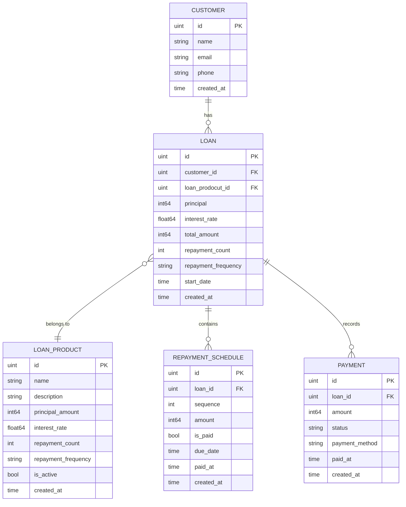

# Loan Billing System

## Description
The **Loan Engine System** is a backend service built to manage customer loans, repayment schedules, and payments for amartha finance
It provides:
- Loan creation and retrieval
- Automatic calculation of outstanding balances
- Detection of delinquent loans

## Assumption
The system assume or out of scope to be build :
- customer did not need to use credential
- loan can be weekly or monthly
- for repayment schedule it only have due date not invoice date
- payment can be made at any time (without penalty fee)
- delinquent status happened when there is two record for certain loan in repayment_schedule that already pass the due date
- outstanding amount calculate based on unpaid data in repayment_schedule

---

## Tech Stack
- **Language:** Go (Golang)
- **Framework:** Gin (HTTP router)
- **ORM:** GORM
- **Database:** PostgreSQL
- **Containerization:** Docker & Docker Compose
- **Testing:** GoMock & Testify
- **Dependency Management:** Go Modules

---

## How to Run (Docker)
### 1. Clone the repository
```bash
git clone https://github.com/yourusername/loan-billing-system.git
cd loan-billing-system
```

### 2. Build & Run with Docker Compose
```bash
docker-compose up --build
```

This will:
- Start **PostgreSQL** on port `5432`
- Start **Loan Engine** on port `8080`

## System Design


---

## 📬 API Endpoints
| Method | Endpoint                 | Description                                                                    |
|--------|--------------------------|--------------------------------------------------------------------------------|
| POST   | `/customers`             | Create new customers                                                           |
| GET    | `/customers`             | Get all customer with filter                                                   |
| GET    | `/customers/:id`         | Get customer with full loan details and also outstanding and delinquent status |
| POST   | `/loan-products`         | Create new loan product                                                        |
| GET    | `/loan-products`         | Get all loan products with filter                                              |
| GET    | `/loan-products/:id`     | Get loan products by id                                                        |
| POST   | `/loans`                 | Create loan for specific user                                                  |
| POST   | `/loans/:id/pay`         | Pay loan                                                                       |
| GET    | `/loans/:id/outstanding` | Get outstanding amount for a loan                                              |
| POST   | `/loans/:id/delinquent`  | Get delinquent status of a loan                                                |
| GET    | `/loans/:id/outstanding` | Get total outstanding amount by customer                                       |
